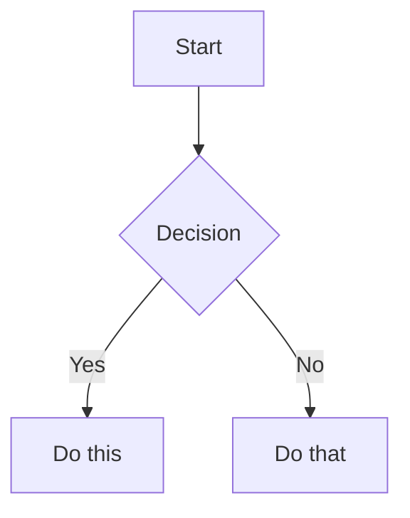
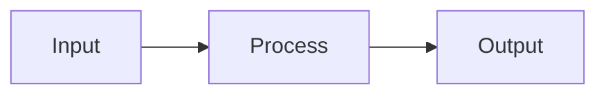

parent: [[MOC-agent-skills]]
---

# Obsidian Flavored Markdown Skill

This skill enables creating and editing valid Obsidian Flavored Markdown, including all Obsidian-specific syntax extensions.

## Overview

Obsidian uses a combination of Markdown flavors:
- [CommonMark](https://commonmark.org/)
- [GitHub Flavored Markdown](https://github.github.com/gfm/)
- [LaTeX](https://www.latex-project.org/) for math
- Obsidian-specific extensions (wikilinks, callouts, embeds, etc.)

## Quick Reference

### Basic Formatting

| Style | Syntax | Example |
|-------|--------|---------|
| Bold | `**text**` | **Bold** |
| Italic | `*text*` | *Italic* |
| Strikethrough | `~~text~~` | ~~Striked~~ |
| Highlight | `==text==` | ==Highlighted== |
| Inline code | `` `code` `` | `code` |

### Escaping
Use backslash: `\*`, `\_`, `\#`, `` \` ``, `\|`

## Internal Links (Wikilinks)

```markdown
[[Note Name]]
[[Note Name|Display Text]]
[[Note Name#Heading]]
[[Note Name#Heading|Custom Text]]
[[#Heading in same note]]
```

### Link to Blocks
```markdown
[[Note Name#^block-id]]
```

Define block: `Text here. ^my-block-id`

### Search Links
```markdown
[[##heading]]    Search for headings
[[^^block]]      Search for blocks
```

## Embeds

```markdown
![[Note Name]]
![[Note Name#Heading]]
![[image.png]]
![[image.png|300]]     Width only
![[image.png|640x480]]
```

## Callouts

> [!note]
> This is a note callout.

> [!tip] Custom Title
> This callout has a custom title.

> [!warning]- Collapsed by default
> This content is hidden until expanded.

| Type | Aliases | Description |
|------|---------|-------------|
| note | - | Blue, pencil icon |
| abstract | summary, tldr | Teal, clipboard |
| info | - | Blue, info |
| tip | hint, important | Cyan, flame |
| success | check, done | Green, checkmark |
| question | help, faq | Yellow, question |
| warning | caution, attention | Orange, warning |
| failure | fail, missing | Red, X |
| danger | error | Red, zap |
| bug | - | Red, bug |
| example | - | Purple, list |
| quote | cite | Gray, quote |

## Properties (Frontmatter)

```yaml
---
title: My Note
date: 2024-01-15
tags:
  - project
  - important
aliases:
  - My Note
  - Alternative Name
status: in-progress
rating: 4.5
completed: false
---
```

### Property Types
- Text: `title: My Title`
- Number: `rating: 4.5`
- Checkbox: `completed: true`
- Date: `date: 2024-01-15`
- List: `tags: [one, two]`
- Links: `related: "[[Other Note]]"`

## Task Lists

```markdown
- [ ] Incomplete task
- [x] Completed task
- [ ] Task with sub-tasks
  - [ ] Subtask 1
  - [x] Subtask 2
```

## Code Blocks

```markdown
```javascript
function hello() {
  console.log("Hello, world!");
}
```
```

## Tables

```markdown
| Header 1 | Header 2 | Header 3 |
|----------|----------|----------|
| Cell 1   | Cell 2   | Cell 3   |
```

### Alignment
```markdown
| Left | Center | Right |
|:-----|:------:|-------:|
| Left | Center | Right |
```

## Math (LaTeX)

Inline: `$e^{i\pi} + 1 = 0$`

Block:
```markdown
$$
\sum_{i=1}^{n} i = \frac{n(n+1)}{2}
$$
```

## Comments

```markdown
This is visible %%but this is hidden%% text.
```

## Tags

```markdown
#tag
#nested/tag
#tag-with-dashes
```

## Mermaid Diagrams



## Complete Example

```markdown
---
title: Project Alpha
date: 2024-01-15
tags: [project, active]
status: in-progress
priority: high
---

# Project Alpha

## Overview

This project aims to [[improve workflow]].

> [!important] Key Deadline
> Due on ==January 30th==.

## Tasks

- [x] Initial planning
- [ ] Development
- [ ] Testing

## Diagram



## Related

- [[Meeting Notes]]
- [[Team Members]]
```

## Use in Our Vault

Use this skill when:
- Creating new notes in the vault
- Adding wikilinks to connect ideas
- Using callouts for emphasis
- Adding properties/frontmatter
- Building task lists
- Creating diagrams for visual thinking
